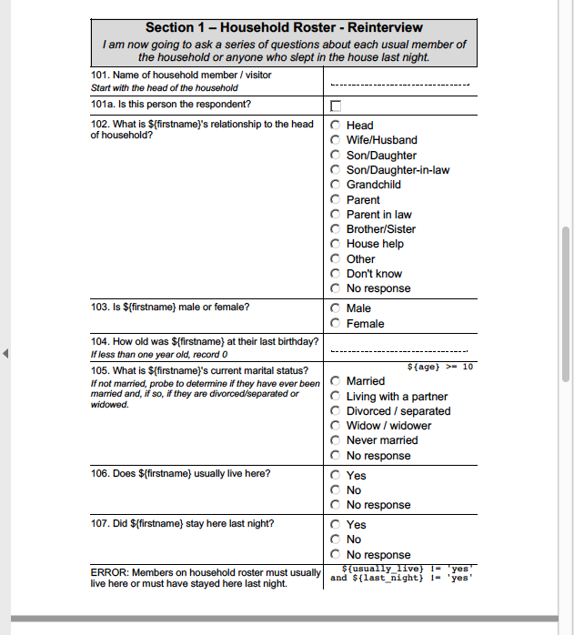

#### `master` [](https://circleci.com/gh/PMA-2020/ppp-web/tree/master) |  `develop` [](https://circleci.com/gh/PMA-2020/ppp-web/tree/develop)

# PPP
## About
PPP is a project with the purpose of helping people convert XlsForm Excel files into more human-readable, printable formats, commonly called "paper questionnaires". Officially, PPP stands for "Pretty PDF Printer", but other formats are supported. The project consists of...

- A [web application](https://github.com/pma-2020/ppp-web)
- A [command line tool](https://github.com/pma-2020/ppp)

Both tools are open source and free to install. You can also use it online with no installation necessary, at http://ppp.pma2020.org.

#### Samples
- Source Excel file: [demo.xlsx](docs/demo.xlsx)
- Converted to PDF: [demo.pdf](docs/demo.pdf)
- Converted to DOC: [demo.doc](docs/demo.doc)
- Manually saved as DOCX from DOC: [demo.docx](docs/demo.docx)
- Converted to HTML: [demo.html](docs/demo.html)

**Example Screenshot**



## Application Internals

Application contains only one page with web form, where user can upload an ODK XlsForms file
for conversion to HTML, PDF of DOC format.

#### UI libraries:
- [Twitter Bootstrap](http://getbootstrap.com/)
- [Bootstrap File Input](http://plugins.krajee.com/file-input)
- [jQuery v2.2.4](https://jquery.com/)
- [Notify.js](https://notifyjs.com/)

#### Backend libraries:
- [Flask](http://flask.pocoo.org/)
- [wkhtmltopdf](https://wkhtmltopdf.org/)


#### Tips
- Backend: conversion to DOC format implemented as conversion to HTML file and returning this HTML file to user
with .doc extension instead of .html, as office programs understands how to render such files.
- Backend: conversion to PDF format implemented as conversion to HTML with next conversion to PDF using **wkhtmltopdf** external tool.
- UI: After successful uploading, form will be cleared automatically.
- UI: If something was wrong while processing the file, page will be reloaded and error message will be shown.
- UI: manually selecting/deselecting conversion options will activate "Custom" preset button.


# Deployment

#### 1. Update system and install required packages
This deployment guide is written for [*Ubuntu*](https://www.linode.com/docs/getting-started/#ubuntu-debian). For other Linux distributions, please refer to this [handy setup guide](https://www.linode.com/docs/getting-started/#install-software-updates), especially if using *Linode*.

`apt-get update && apt-get upgrade`

> **Note**  
> Ubuntu may prompt you when the Grub package is updated. If prompted, select keep the local version currently installed.

`apt-get install htop libfontconfig1 libxrender1 python3-pip python3-dev python3-venv nginx git vim`

#### 2. Clone project from repo

`cd /opt`

`/opt $` `git clone https://github.com/PMA-2020/ppp-web.git`

#### 3. Create virtual environment

`/opt $` `cd ppp-web`

`/opt/ppp-web $` `python3 -m venv .venv`

`/opt/ppp-web $` `source .venv/bin/activate`

`/opt/ppp-web $` `pip install --upgrade pip`

#### 4. Dependencies
Install project dependencies

`/opt/ppp-web $` `pip install -r requirements.txt`

Install pmix package

`/opt/ppp-web $ pip install -r https://raw.githubusercontent.com/<git-suburl>/requirements.txt`  
> **Example**  
> `pip install -r https://raw.githubusercontent.com/jkpr/pmix/develop/requirements.txt`

> **Note**  
> You may experience a `DistutilsError` related to the `cairocffi` package. If this occurs, it is likely OK to ignore, as this is a peer dependency and not required for PPP-Web.

`/opt/ppp-web $ pip install https://github.com/<git-suburl>`  
> **Examples**
> `pip install https://github.com/jkpr/pmix/archive/develop.zip`
> `pip install https://github.com/joeflack4/pmix/archive/ppp.zip`

#### 5. Required Configuration
##### Change Python executable path
Edit config.py  
`/opt/ppp-web $` `cd ppp_web`
`/opt/ppp-web/ppp_web $` `vim app_instance/config.py`

Set Python executable variable  
`PYTHON_PATH='/opt/ppp-web/.venv/bin/python3'`


##### Set execution flag for dependency *wkhtmltopdf*

`/opt/ppp-web/ppp_web $` `chmod +x bin/wkhtmltopdf`

#### 6. Set up logging
`mkdir logs/`  
`touch access-logfile.log && touch error-logfile.log`

#### 7. Run server process
Run the app_instance in background

`/opt/ppp-web/ppp_web $` `gunicorn -b 0.0.0.0:8080 run:app_instance &`

Open web interface at address

`https://<server-ip>:8080`

You're finished!


## Maintenance
### Upgrading PPP-Web
#### Log in to server & activate environment
> Common Workflows > [Logging in to server](#logging-in-to-server)  
> Common Workflows > [Activate virtual environment](#activate-virtual-environment)

There are several options from here. One option to get changes is to checkout a 
remote branch locally and reapply a change *config.py* as shown in the first 
part of step (5) in the *Deployment* section. Another option is to back up and 
clone a fresh copy of the repo. Another option is to stash any current changes, 
rebase/merge, and recover the stash. Another option is to commit any current 
changes and then do a rebase of the/a remote branch onto the/a local one. 
That's the one we'll show here.

#### Backup current install (optional)
This step is optional, as git in itself is a backup mechanism.

`cd /opt/`  
`mkdir _archive` *(if it doesn't exist)*  
`mv ppp-web _archive/DATE`  
> **Example**
> `mv ppp-web _archive/2018-02-20` 

#### Commit local changes
Add local changes to staging  
`git add .`

Commit local changes. If all you've done during/since deployment is change 
config.py, the following message should do.  
`git commit -m "Updated PYTHON_PATH path in config.py during deployment
installation process."`

#### Get remote changes
Add any additonal remotes if required to fetch from

`git remote add trunk https://github.com/PMA-2020/ppp-web.git`  
> **Example**  
> ```
> git remote add trunk https://github.com/PMA-2020/ppp-web.git && \
> git remote add joeflack4 https://github.com/joeflack4/ppp-web.git
> ```

Fetch changes

`git fetch --all`

Merge in changes using rebase
`git rebase REMOTE/BRANCH`
> **Example**  
> `git rebase trunk/master`

#### [Start](#starting-the-server) or [restart](#restarting-the-server) server
> Common Workflows > [Starting the server](#starting-the-server)

### Upgrading Dependencies
#### Log in to server & activate environment
> Common Workflows > [Logging in to server](#logging-in-to-server)  
> Common Workflows > [Activate virtual environment](#activate-virtual-environment)

#### Upgrade dependency
`python -m pip install <url-to-dependency> --upgrade`

> **Example**
> `python -m pip install git+https://github.com/jkpr/pmix@develop --upgrade` 

#### Restart server
> Common Workflows > [Restart server](#restarting-the-server)


## Common Workflows
### Logging in to server
`ssh <server>` and enter password when prompted. 

> **Examples**
> Production: `root@192.155.80.11`
> Staging: `root@172.104.31.28`

### Starting the server
#### Activate environment
> Common Workflows > [Activate virtual environment](#activate-virtual-environment)

#### Run server process
`cd /opt/ppp-web/ppp_web`
`/opt/ppp-web/ppp_web $` `gunicorn -b 0.0.0.0:8080 run:app_instance &`

### Restarting the server
#### Find process ID  
The server that PPP-Web uses is called "gunicorn", so...  
`ps -e | grep gunicorn`  

#### Kill process  
`kill -9 <ID>`, where "<ID>" is the one found in previous step.
#### Start new process
> Common Workflows > [Starting the server](#starting-the-server)

### Activate virtual environment
`cd /opt/ppp-web`  
`/opt/ppp-web $` `source .venv/bin/activate`

---

# PPP

## A propos

PPP est un projet visant à aider les utilisateurs à convertir les fichiers Excel XlsForm en des formats imprimables, plus lisibles par l'homme, appelés communément "questionnaires sur papier". Officiellement, PPP signifie "Pretty PDF Printer", mais d'autres formats sont supportés. Le projet consiste en :

- une [application Web] (https://github.com/pma-2020/ppp)
- Un [outil de ligne de commande] (https://github.com/pma-2020/ppp-web)

Les deux outils sont open source et gratuits à installer. Vous pouvez également l'utiliser en ligne sans aucune installation nécessaire, à l'adresse http://ppp.pma2020.org.

#### Echantillons
- Fichier Excel source: [demo.xlsx] (docs / demo.xlsx)
- Converti en PDF: [demo.pdf] (docs / demo.pdf)
- Converti en DOC: [demo.doc] (docs / demo.doc)
- enregistré manuellement au format DOCX à partir de DOC: [demo.docx] (docs / demo.docx)
- Converti en HTML: [demo.html] (docs / demo.html)


** Exemple Capture d’écran **

! [demo.png] (docs / demo.png)

## Documentation pour les utilisateurs finaux
### Installation
`pip install odk-ppp`

### CLI
#### Arguments de position
| Argument | Description |
|: --------- |: ------------ |
| xlsxfile | Chemin d'accès à la source XLSForm. |

#### Options
| Drapeau court | Drapeau long | Description |
|: ----------- |: ---------- |: ------------ |
| -h | --help | Afficher ce message d'aide et quitter.
| -d | --debug | Active le mode débogage. Actuellement, ne fonctionne que pour le format 'html'. La seule caractéristique du mode débogage est qu’il imprime une représentation JSON sous forme de chaîne de sondage sur la console JavaScript.
| -H | --highlight | Active la mise en évidence de différentes parties des composants de l’enquête. Utile pour évaluer le positionnement.
| -o | --outpath | Chemin pour écrire la sortie. Si cet argument n'est pas fourni, STDOUT est utilisé. Options: `-o OUPATH`.

| -l | --language | Langue dans laquelle écrire la version papier. S'il n'est pas spécifié, le ‘langage’' par défaut’ dans les ‘’settings’’ de la  feuille de calcul  est utilisé. Si cela n'est pas spécifié et qu'il existe plusieurs langues  dans la XLSForm, la langue qui vient en premier par ordre alphabétique sera utilisée. Option: `-l LANGUAGE`.

| -f | --format | les formats de fichier.HTML et DOC sont des formats pris en charge. PDF n'est pas pris en charge, mais vous pouvez facilement  de convertir un fichier PPP .doc en PDF en utilisant 
* wkhtmltopdf * (https://wkhtmltopdf.org/). Si cet indicateur ( flag) n'est pas fourni, la sortie est HTML par défaut. Option `-f {html, doc}`.

| -i | --input-replacement | L'ajout de cette option activera le remplacement des options de choix visibles dans les champs de saisie. Au lieu des options de choix normales, tout ce qui a été placé dans le champ 'ppp_input' du XlsForm sera utilisé. C'est normalement pour cacher les informations sensibles.

| -e | --exclusion | L'ajout de cette option activera l'exclusion de certains composants du formulaire d'enquête du formulaire rendu. Cela peut être utilisé pour supprimer du formulaire des éléments d'implémentation spécifiques à ODK qui ne sont utiles que pour les développeurs et peuvent également être utilisés pour supprimer complètement les informations sensibles sans aucun remplacement.

| -r | --hr-relevant | L'ajout de cette option activera l'affichage du texte «relevant» lisible par l'homme, plutôt que la logique codifiée , qui exige beaucoup de syntaxe,.
| -c | --hr-contrainte | L'ajout de cette option basculera l'affichage du texte de «constraint» lisible par l'homme, plutôt que la logique codée, très lourde en syntaxe du XlsForm d’origine.

| -C | --no-contrainte | L'ajout de cette option activera la suppression de toutes les contraintes du formulaire rendu.

| -t | --text-remplacements | L'ajout de cette option basculera les remplacements de texte, comme indiqué dans la feuille de calcul 'text_replacements' du XlsForm. La fonction la plus courante du remplacement de texte consiste à rendre davantage de noms de variables lisibles par l’homme, mais elle peut également être utilisée pour supprimer des informations sensibles ou pour ajouter de la concision / clarté si nécessaire.
| -p | --preset | Choisissez parmi un préréglage d'options groupées. Le préréglage 'developer' rend le formulaire le plus similaire possible au XlsForm d'origine. Le préréglage «internal» est plus lisible par l’homme mais n’est pas dépourvu d’informations sensibles. L'option "public" est similaire à l'option "internal", mais sans informations sensibles supprimées. Options: `-p {public, internal, developper, standard}


#### Examples d'usage

`python3 -m ppp myXlsForm.xlsx`
> * Imprime des XlsForm convertis en HTML avec les paramètres par défaut sur la console *

> `python3 -m ppp mon XlsForm.xlsx -l Français-f doc -p standard> myXlsForm.doc`
> * Convertit un fichier ODK Excel en un fichier .doc lisible en MS Word (c'est vraiment du HTML sous le capot), avec le préréglage de "standard" et la langue définie au  Français *

> `python3 -m ppp monXlsForm1.xlsx monXlsForm2.xlsx -l Luganda Lusoga anglais -f doc pdf -p standard détaillé`
> * Enregistre un document pour chaque combinaison de formulaires et d'options passés, dans ce cas :
** 2 ** fichiers d'entrée \ * ** 3 ** langues \ * ** 2 ** formats de fichier \ * ** 2 ** formats de détail , ou ** 24 ** fichiers de sortie *
